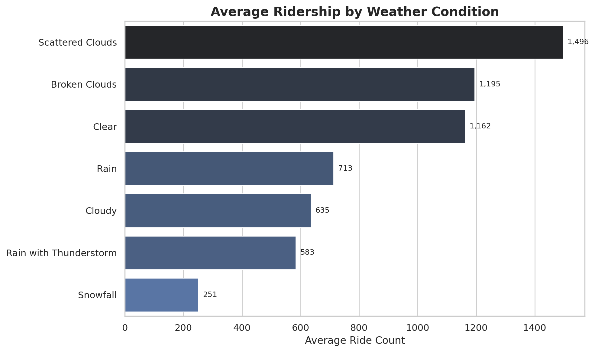
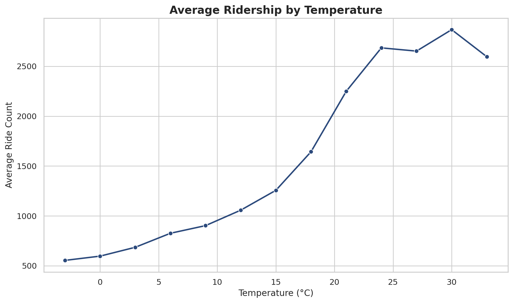
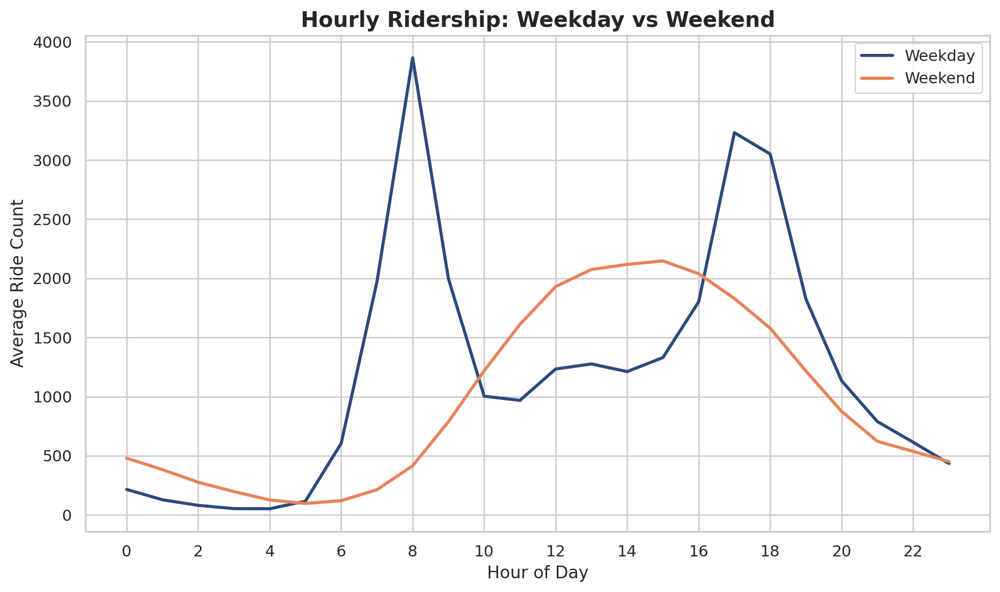
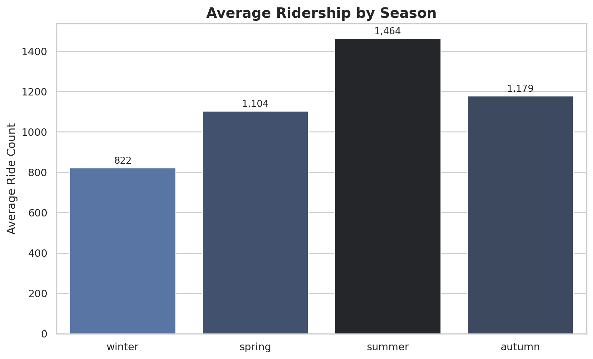

# The Overview
Welcome to my analysis of London's bike-share program. As a data analyst, I wanted to understand how external conditions — weather, temperature, time of day, and time of week — shape ridership behavior. This project cleans a raw dataset of over 17,000 hourly ride records and explores the patterns behind when and why people choose to ride.

The dataset provides hourly ride counts alongside temperature, humidity, wind speed, weather condition, and calendar flags (holiday, weekend, season). Through a series of Python scripts, I explore how ridership shifts with weather and temperature, and how weekday commuter behavior differs from weekend leisure riding.

# The Questions
Below are the questions I want to answer in my project:
1. How does weather condition affect ridership?
2. How does temperature affect ridership?
3. How does ridership differ between weekdays and weekends?
4. How does ridership shift across the seasons?

# Tools I Used
For my deep dive into London's bike-share data, I imported several key tools:
- **Python**: The backbone of my analysis, allowing me to clean the data and uncover critical insights. I also used the following Python libraries:
    - **Pandas Library**: To perform my data cleaning and analysis.
    - **Matplotlib Library**: To visualize my data.
    - **Seaborn Library**: To create more advanced and sophisticated visualizations.
- **Jupyter Notebook**: Used to run my Python scripts, including my cleaning steps and commentary notes.
- **Visual Studio Code**: Where I execute my Python scripts.
- **Tableau**: Used to build an interactive dashboard featuring a 20-day moving average of ridership.
- **Git & GitHub**: Essential for version control and sharing my Python code and analysis.

# Data Preparation and Cleanup
This section outlines the data cleaning steps taken to prepare the data for analysis, ensuring accuracy, readability, and usability.

## Import & Cleaning Data
I start by importing necessary libraries and loading the dataset, followed by:
- Renaming columns for clarity (e.g., `t1` → `temp_real_C`, `hum` → `humidity_percent`)
- Converting humidity values to percentages
- Mapping coded season and weather integers into readable labels (e.g., `1` → Clear, `3` → winter)
- Exporting the cleaned dataset for analysis and Tableau visualization

View my notebook with detailed steps here: [London_Bike_Rides_Data_Cleaning.ipynb](London_Bike_Rides_Data_Cleaning.ipynb)

# The Analysis

## 1. How does weather condition affect ridership?

I grouped the cleaned dataset by weather condition and calculated the average hourly ride count for each, to see which conditions saw the highest and lowest ridership.

### Visualize Data

```python
weather_avg = df.groupby('weather')['count'].mean().sort_values(ascending=False)

sns.barplot(x=weather_avg.values, y=weather_avg.index, hue=weather_avg.values, palette='dark:b_r', legend=False)
plt.title('Average Ridership by Weather Condition')
plt.xlabel('Average Ride Count')
plt.show()
```

### Results



### Insights

- Scattered Clouds produced the highest average ridership (1,496) of any weather condition — even higher than fully Clear skies (1,162), a slightly counter-intuitive finding.
- Ridership in Clear weather was 66% higher than in combined Rain/Snow conditions (1,162 vs. 700 average), confirming that adverse weather is a strong deterrent to ridership.
- Snowfall saw the lowest ridership by a wide margin (251 average), roughly 6x lower than the best-performing condition.

## 2. How does temperature affect ridership?

I bucketed hourly records into 3°C temperature bands and calculated average ridership for each, to see how closely ridership tracks with temperature.

### Visualize Data

```python
df['temp_bucket'] = (df['temp_real_C']//3)*3
temp_trend = df.groupby('temp_bucket')['count'].mean().reset_index()

sns.lineplot(data=temp_trend, x='temp_bucket', y='count', marker='o')
plt.title('Average Ridership by Temperature')
plt.xlabel('Temperature (°C)')
plt.ylabel('Average Ride Count')
plt.show()
```

### Results



### Insights

- Ridership rises steadily and consistently as temperature increases, from an average of 554 rides near freezing up to a peak average of 2,867 rides around 30°C.
- The relationship is close to linear through most of the range, suggesting temperature is one of the strongest single predictors of ridership in this dataset.
- Ridership dips slightly past 30°C, suggesting a comfort ceiling beyond which extreme heat starts to reduce ridership rather than encourage it further.

## 3. How does ridership differ between weekdays and weekends?

I compared average ridership by hour of day, split between weekday and weekend records, to see whether the data revealed distinct rider behavior patterns.

### Visualize Data

```python
weekday = df[df['is_weekend']==0].groupby('hour')['count'].mean()
weekend = df[df['is_weekend']==1].groupby('hour')['count'].mean()

sns.lineplot(x=weekday.index, y=weekday.values, label='Weekday')
sns.lineplot(x=weekend.index, y=weekend.values, label='Weekend')
plt.title('Hourly Ridership: Weekday vs Weekend')
plt.xlabel('Hour of Day')
plt.ylabel('Average Ride Count')
plt.show()
```

### Results



### Insights

- Weekday ridership shows a clear double-peak commuter pattern, spiking sharply at 8am (3,864 rides) and again at 5-6pm (3,232 / 3,052 rides) — consistent with people riding to and from work.
- Weekend ridership instead follows one broad, gradual curve, peaking in the early afternoon around 1-3pm (2,075-2,148 rides), with no rush-hour spikes at all.
- This confirms two distinct rider segments in the data: weekday commuters and weekend leisure riders, each with a fundamentally different usage pattern.

## 4. How does ridership shift across the seasons?

I grouped the dataset by season to see how ridership compares across the year.

### Visualize Data

```python
season_avg = df.groupby('season')['count'].mean().reindex(['winter','spring','summer','autumn'])

sns.barplot(x=season_avg.index, y=season_avg.values, hue=season_avg.values, palette='dark:b_r', legend=False)
plt.title('Average Ridership by Season')
plt.ylabel('Average Ride Count')
plt.show()
```

### Results



### Insights

- Summer saw the highest average ridership of any season, consistent with the strong positive relationship between temperature and ridership found earlier.
- Winter saw the lowest average ridership, reinforcing that cold weather — not just precipitation — plays a meaningful role in suppressing ridership.
- Autumn outperformed Spring slightly, suggesting factors beyond temperature alone (like daylight hours or seasonal routine) may also be at play.

# Interactive Dashboard

In addition to the Python analysis above, I built an interactive Tableau dashboard to explore ridership trends over the full dataset period (January 2015 – January 2017). The dashboard features:

- A **20-day moving average line chart**, smoothing out daily noise to reveal longer-term ridership trends across the full two-year period, with a draggable timeline to select and inspect any custom date range
- A **Temperature vs. Wind Speed heatmap**, binning ride counts across both variables simultaneously to reveal how the two factors interact — for example, showing that the highest ridership concentrations cluster in moderate-temperature, low-to-moderate wind conditions, while ridership drops off at both weather extremes

**[View the Interactive Dashboard on Tableau Public →](https://public.tableau.com/app/profile/patrick.chau7690/viz/LondonBikeRides_17781088190310/Dashboard1)**
